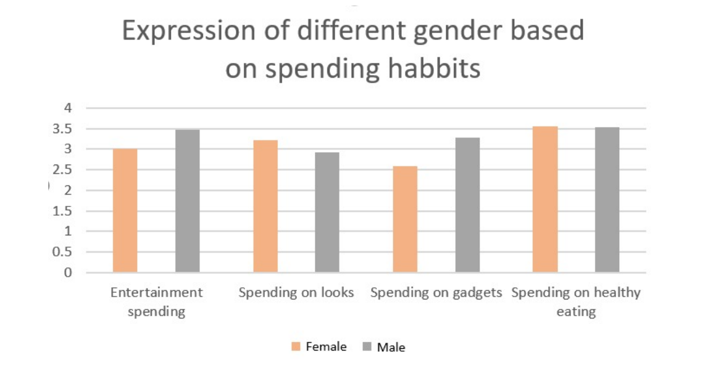
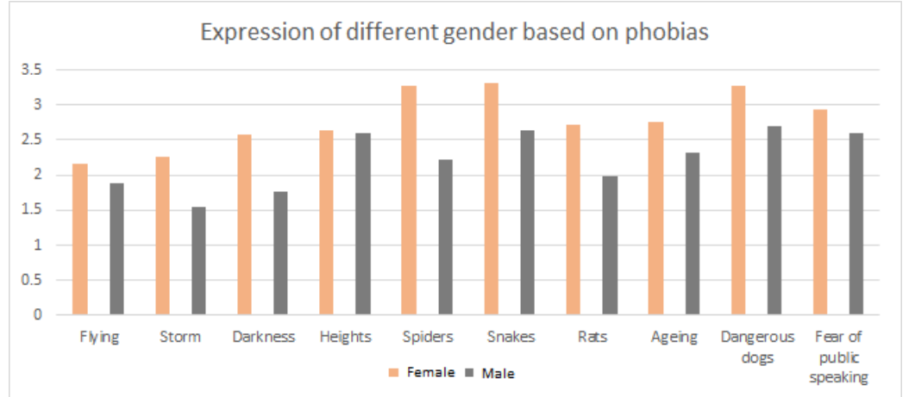
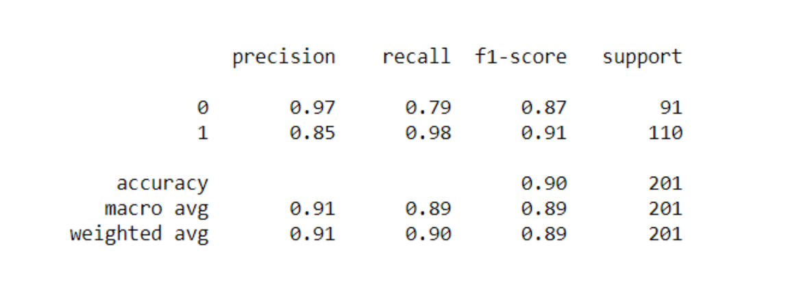
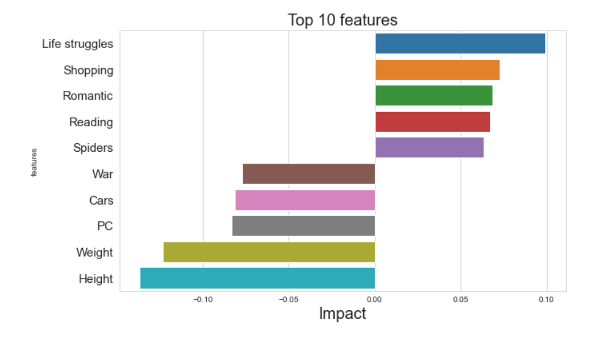

# Objective
Understanding Gender Differences based on Different Psychological Preferences

# Data Description
The dataset used in this study is taken from a “Young People Survey” from the Kaggle website
(https://www.kaggle.com/miroslavsabo/young-people-survey). The data consists of around 150
categories of music and movie preferences, hobbies and habits, interests, opinions, phobias,
and demographics, etc. Around a thousand Slovakian people, aged between 15 to 30 years
participated in this survey.

# EDA & Hypothesis Testing
Some hypothesis results are presented below-

## For Spending Habits
**Hypothesis**: There is no significant difference between ratings by males and females for their
spending on looks.
**Assumption:** Alpha value(significance level) = 0.05
**z-Test:** Two-Sample for Means

**P(Z<=z) two-tail** 0.00017473855587169
**Result:** Since the P-value comes out to be less than alpha(0.05), the null hypothesis can be
rejected. Hence it can be concluded that there is a significant difference between rating by male
and female for their spending on looks.

## For Phobias
**Hypothesis:** The fear of heights is the same in females and males.
**Z-test:** Two-Sample for Means
**Assumption:** Alpha value(significance level) = 0.05

**P(Z<=z) two-tail** 0.566079467
**Result:** Since the p-value is greater than alpha(in this case 0.05), the null hypothesis is not
rejected. The fear of height is expressed the same by males and females.

# Classification Model
After understanding the differences I want to check whether a good accuracy model can be made based on the data we have that predicts the gender of a person.

Classification report of the final model is shown below.

The 10 most important features based on impact are shown below.

